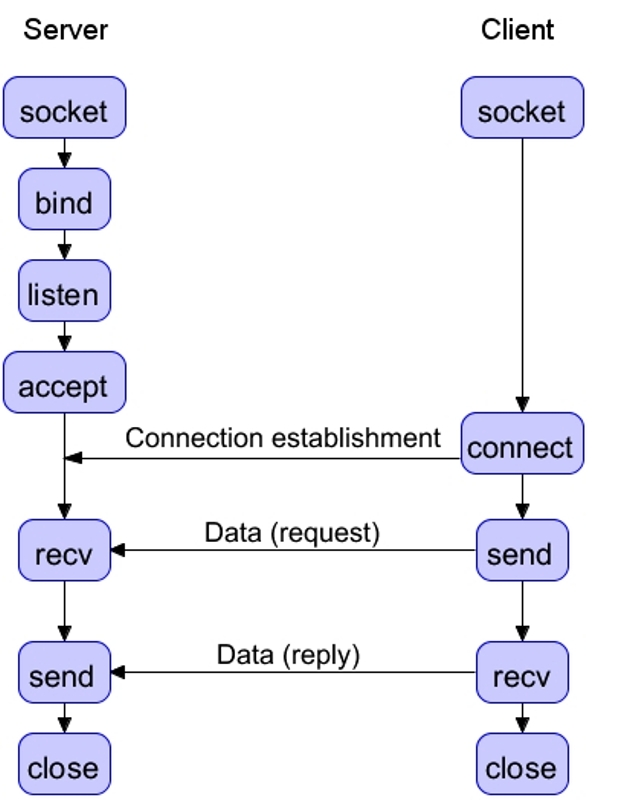

# Socket Networking Programming dengan C++

## 📃 Deskripsi
Ini adalah contoh dokumentasi **socket programming** menggunakan bahasa **C++**. Tujuan utamanya adalah untuk memahami cara membuat **server** dan **client** sederhana yang dapat saling berkomunikasi melalui **TCP** atau **UDP**. 

> **Catatan:** Setiap sistem operasi memiliki API Socket Networking yang berbeda.

## 🌐 Socket dan OSI Layer
Socket berfungsi sebagai **abstraksi pemrograman** untuk melakukan komunikasi antar komputer melalui jaringan.  

### OSI 7 Layer Model

</img>

1. **Application Layer** – protokol aplikasi (HTTP, FTP, SMTP, dll.)
2. **Presentation Layer** – encoding, enkripsi, kompresi.
3. **Session Layer** – menjaga sesi komunikasi (sinkronisasi).
4. **Transport Layer** – mengatur aliran data, segmentasi, reliabilitas (TCP/UDP).
5. **Network Layer** – routing dan pengalamatan (IP Address).
6. **Data Link Layer** – komunikasi antar perangkat dalam satu jaringan (Ethernet, Wi-Fi).
7. **Physical Layer** – media fisik (kabel, sinyal, radio).

**Socket API** bekerja **antara Application Layer dan Transport Layer**, Dari sisi pemrogram, kita membuat aplikasi di Socket menyediakan akses ke protokol **Transport Layer** (TCP/UDP). Socket juga menyediakan akses ke protokol **Application Layer** dapat implementasi (HTTP) dari TCP.

📌 Socket bisa dianggap sebagai **jembatan** antara **Application Layer** dan **Transport Layer**.

## 🔌 Socket API Function

</img>

Berikut adalah function utama yang umum digunakan dalam **Socket API** (POSIX / Winsock).  

| Function            | Deskripsi                                                                 |
|---------------------|---------------------------------------------------------------------------|
| `socket()`          | Membuat socket baru (menentukan domain, type, protocol).                  |
| `bind()`            | Mengikat socket ke IP Address dan port tertentu.                          |
| `listen()`          | Menandai socket agar siap menerima koneksi (khusus TCP server).           |
| `accept()`          | Menerima koneksi dari client pada socket server (blocking).              |
| `connect()`         | Menghubungkan socket client ke server tertentu.                          |
| `send()`            | Mengirim data melalui socket (TCP).                                       |
| `recv()`            | Menerima data dari socket (TCP).                                          |
| `sendto()`          | Mengirim data ke IP Address tertentu (digunakan untuk UDP).                  |
| `recvfrom()`        | Menerima data dari IP Address tertentu (digunakan untuk UDP).                |
| `close()` / `closesocket()` | Menutup koneksi socket. (`close` di Linux/Unix, `closesocket` di Windows). |
| `shutdown()`        | Menutup sebagian koneksi (misalnya hanya read atau hanya write).         |
| `getsockopt()`      | Mendapatkan opsi atau konfigurasi dari socket.                           |
| `setsockopt()`      | Mengatur opsi atau konfigurasi socket (misalnya `SO_REUSEADDR`).          |
| `getaddrinfo()`     | Resolusi nama host ke IP Address dan parameter socket.                    |
| `freeaddrinfo()`    | Membebaskan memori hasil `getaddrinfo()`.                                |
| `inet_pton()`       | Mengonversi IP Address dari teks ke biner.                                |
| `inet_ntop()`       | Mengonversi IP Address dari biner ke teks.                                |

> **Catatan:** Pada **Windows (Winsock)**, sebelum menggunakan fungsi socket, perlu inisialisasi dengan `WSAStartup()`, dan diakhiri dengan `WSACleanup()`. Perlu menutup juga dengan `closesocket();`.

## ✨ Fitur
- Implementasi **TCP server** dan **TCP client**.
- Implementasi **UDP server** dan **UDP client** (opsional).
- Komunikasi dua arah (*bi-directional*).
- Penanganan error dasar.
- Cross-platform (Windows/Linux) dengan penggunaan `#ifdef`.

## ❗ Prasyarat
- **C++17/20/23 compiler** (GCC/G++, Clang, atau MSVC).
- Pengetahuan tentang:
    - C++ Fundamental (Input/Output, Tipe Data, Casting, Percabangan, Perulangan, Preprocessor, dll).
    - Networking (TCP/UDP, IP address, port).

## 📚 Learn Socket Networking

- ### Windows:
1. [TCP socket connection](https://github.com/MuzakyGood/Belajar_CppSocket/tree/main/Windows/1.TCPConnection)
2. [HTTP socket connection](https://github.com/MuzakyGood/Belajar_CppSocket/tree/main/Windows/2.HTTPConnection)
3. [UDP socket connection](https://github.com/MuzakyGood/Belajar_CppSocket/tree/main/Windows/3.UDPConnection)

- ### Linux / MacOS (🔒Coming Soon)

## 📁 Project Socket Networking

- ### Windows (🔒Coming Soon)

- ### Linux / MAcOS (🔒Coming Soon)

---

## ⚙️ Cara compile C++

#### Linux / MacOS
```bash
g++ src/tcp_server.cpp -o server
g++ src/tcp_client.cpp -o client
````

#### Windows (MinGW)

```bash
g++ src/tcp_server.cpp -lws2_32 -o server.exe
g++ src/tcp_client.cpp -lws2_32 -o client.exe
```

> **Catatan:** Untuk pengguna MVSC (Microsoft Visual Studio) perlu menyertakan preprocessor `#pragma comment(lib, "ws2_32.lib")`.

## 🔧 Pengembangan Lanjutan

* Menambahkan dukungan untuk **multithreading** (agar server bisa menangani banyak client sekaligus).
* Menambahkan **enkripsi** sederhana (misalnya AES atau TLS).
* Membuat protokol sederhana di atas TCP (misalnya chat room).
* Menambahkan **logging** untuk debugging.

## 🏷️ Lisensi

Proyek ini dilisensikan di bawah [MIT License](LICENSE).

---